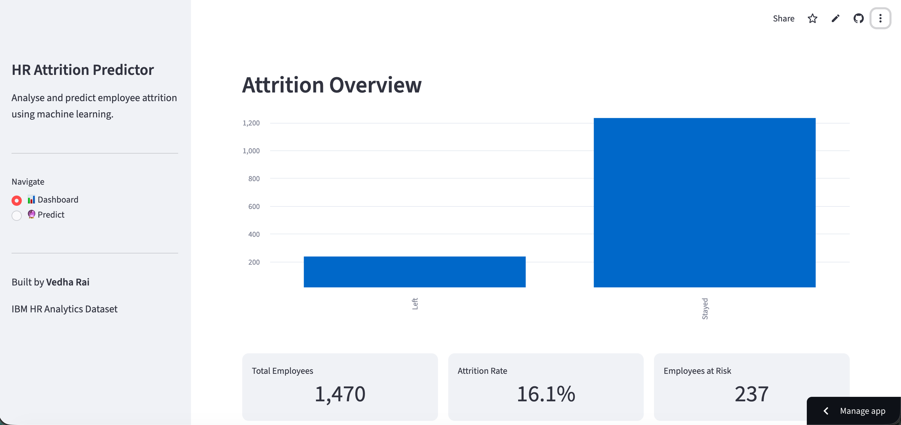
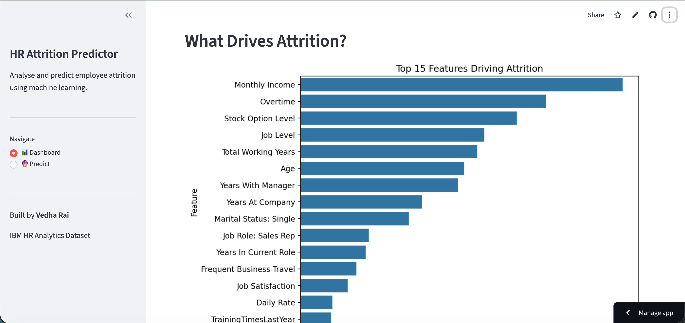

# HR Attrition Predictor
> Analysing key drivers of employee attrition.

## Problem Statement

Companies lose a lot of time and money on hiring and training new employees due to employee attrition. In order to help HR teams take preventive measures, this project builds a machine learning model to forecast which employees are at risk of leaving after analysing the IBM HR Analytics dataset to determine the primary causes of employee turnover.

## Dataset

- IBM HR Analytics Employee Attrition dataset
- 1,470 employees, 35 features
- Target variable: Attrition (Yes/No)

## Tech Stack

- Python, pandas, numpy
- scikit-learn (Logistic Regression, Random Forest)
- imbalanced-learn (RandomUnderSampler)
- matplotlib, seaborn
- Streamlit
- GitHub

## Model Performance

| Model | Accuracy | Class 1 Recall |
|---|---|---|
| Logistic Regression (baseline) | 72% | 0.59 |
| Random Forest (manual tuning) | 80% | 0.51 |
| Random Forest (GridSearchCV) | 80% | 0.51 |
| Random Forest (undersampling) | 78% | 0.56 |

Final app uses Random Forest with undersampling. Recall is prioritised over accuracy due to class imbalance (16.1% attrition rate).

## Key Findings

- Overtime is the single biggest predictor of attrition.
- Employees who left earned significantly less (avg ₹4,787/month vs ₹6,832/month).
- Younger employees (avg age 33.6) leave more than older ones (avg age 37.6).
- Low stock option level and job level are strong attrition signals
- Employees with lower job and environment satisfaction leave more

**Key insight:** Attrition is not just driven by job satisfaction alone, but also majorly by overwork, low pay, and lack of financial incentives.

## How to Run Locally

```bash
git clone https://github.com/vedharai/hr-attrition-predictor
cd hr-attrition-predictor
pip install -r requirements.txt
streamlit run app/app.py
```
## Live Demo
[Website URL](https://hr-attrition-predictor1.streamlit.app/) 

## Screenshots


